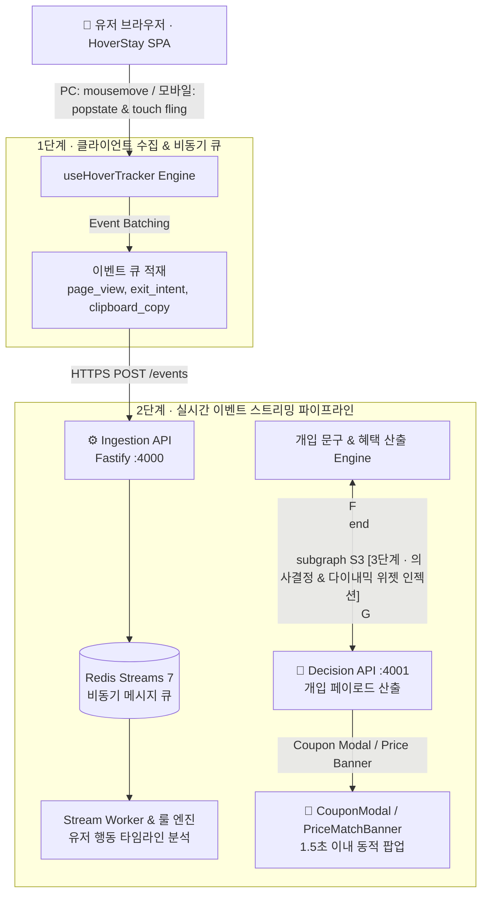

# 🏨 HoverStay (실시간 마케팅 개입 & 이탈 방지 플랫폼)

> **"손님이 이탈하기 전 1.5초, 크로스 디바이스 체류 신호를 읽고 최저가 및 시크릿 할인 혜택을 동적으로 제공합니다"**

<p align="left">
  <a href="https://knu-capston-fe-kreteck.vercel.app" target="_blank">
    
  </a>
  <a href="https://knu-capston-fe-kreteck.vercel.app/admin" target="_blank">
    
  </a>
  <a href="http://localhost:5100">
    
  </a>
  <a href="http://localhost:5001">
    
  </a>
</p>

---

## 🛠️ 기술 스택 (Tech Stack)

### 🎨 Frontend Core & Architecture
<p>
  
  
  
  
  
  
  
</p>

### 🧪 Testing & Quality Assurance
<p>
  
  
</p>

### ⚙️ Backend & Streaming Engine
<p>
  
  
  
  
</p>

### ☁️ Infrastructure & DevOps
<p>
  
  
  
</p>

---

## 📌 서비스 한눈에 보기 (Service Overview)

💡 **"숙소 예약 사이트를 둘러보던 손님, 다른 가격 비교 사이트(아고다/부킹닷컴)로 그냥 떠나보내셨나요?"**

**HoverStay**는 숙소 예약 플랫폼에서 고객이 탭을 닫거나 뒤로 가기를 누르는 등 이탈하려는 순간, **PC 마우스 궤적, 모바일 뒤로가기 제스처, 패스트 스크롤업 터치 플링**을 크로스 디바이스로 포착하여 **15% 시크릿 할인 쿠폰**을 동적으로 전달하여 **구매 전환율(CVR)을 극대화하는 MarTech 엔진 기반 B2C/B2B 웹 서비스**입니다.

---

## 🚀 핵심 고도화 및 차별성 (Major Enhancements)

- **TanStack Query (v5) & Zustand**: 5분 데이터 캐싱, 스켈레톤 UI, 유저/쿠폰 전역 상태 동기화
- **크로스 디바이스 이탈 감지**: PC 마우스 궤적(`mousemove` 15px) & 모바일 뒤로가기(`popstate`) / 패스트 스크롤 포착
- **Vitest 단위 테스트**: Zustand 스토어 및 핵심 컴포넌트 자동화 유닛 테스트 (`npm test` 100% PASS)
- **B2B 마케팅 대시보드 (`/admin`)**: Recharts 기반 A/B 테스트 CVR 전환율 시각화 및 B2C/B2B 경로 완벽 분리

---

## 🛡️ 실시간 이탈 감지 & 이벤트 파이프라인 아키텍처



---

## ✨ 쉽게 알아보는 핵심 기능 (Key Features)

### 1. 🎯 크로스 디바이스 이탈 감지 & B2C 시크릿 할인 쿠폰
- 마우스 주소창 이탈, 모바일 뒤로가기 포착 시 회원을 위한 **15% 시크릿 할인 쿠폰**을 동적 제공합니다.

### 2. 🛡️ 100% 최저가 보장제 상단 안심 배너
- 타 사이트 가격 비교 시도(텍스트 복사) 시 차액 100% 보상 안심 배너를 상단에 고정 노출시킵니다.

### 3. 🔍 아고다 / 부킹닷컴 실사 숙소 검색 & 맞춤 필터링
- 시그니엘, 조선 팰리스 등 5성급 럭셔리 스테이 및 한옥 스테이를 실시간 검색할 수 있습니다.

### 4. 📊 B2B 마케팅 A/B 테스트 & CVR 전환율 대시보드 (`/admin`)
- 이탈 포착 수, 쿠폰 클릭률(CTR), 최종 결제 전환율(CVR)을 직관적인 차트로 모니터링합니다.

---

## 📂 디렉토리 구조 (Directory Structure)

```text
KNU_capston_FE/
├── 📱 frontend/              # Modern React 18 + TypeScript + Vite + Tailwind SPA
│   ├── src/
│   │   ├── __tests__/        # Vitest 자동화 단위 테스트 스위트 (useCouponStore, HotelCard)
│   │   ├── components/       # Header, Footer, HotelCard, CouponModal, PriceMatchBanner, HotelCardSkeleton
│   │   ├── hooks/            # useHoverTracker (크로스 디바이스 이탈 감지), useHotelQueries (TanStack Query)
│   │   ├── pages/            # HomePage, SearchPage, HotelDetailPage, BookingPage, CouponsPage, AdminPage
│   │   ├── store/            # useAuthStore, useCouponStore (Zustand 전역 상태 관리)
│   │   ├── services/         # api.ts (REST API 백엔드 연동)
│   │   └── types/            # TypeScript 모델 스키마
│   ├── package.json          # Vite & Vitest scripts (Port: 5100)
│   └── vite.config.ts        # Vitest & Alias 설정
│
├── ⚙️ backend/               # REST API & Microservices Engine
│   ├── server.js             # Express REST API Server (:5001)
│   └── db.json               # 아고다/부킹닷컴 실사 숙소 데이터베이스
│
├── 🌐 api/                  # Vercel Cloud Serverless API Handler
├── 🚀 vercel.json           # Vercel SPA Routing & Rewrites Configuration
└── 📘 README.md             # 프로젝트 안내서
```

---

## ⚡ 실행 방법 (How to Run & Test)

### 1) 클라우드 라이브 웹 접속
- **B2C 메인 서비스**: [https://knu-capston-fe-kreteck.vercel.app](https://knu-capston-fe-kreteck.vercel.app)
- **B2B 관리자 대시보드**: [https://knu-capston-fe-kreteck.vercel.app/admin](https://knu-capston-fe-kreteck.vercel.app/admin)

### 2) 로컬 환경 실행
```bash
cd frontend
npm install
npm run dev
```
👉 `http://localhost:5100` 접속 후 테스트 가능합니다.

### 3) 단위 테스트 실행
```bash
cd frontend
npm test
```
👉 Vitest 스위트로 4개 항목 100% PASS 검증을 진행합니다.
