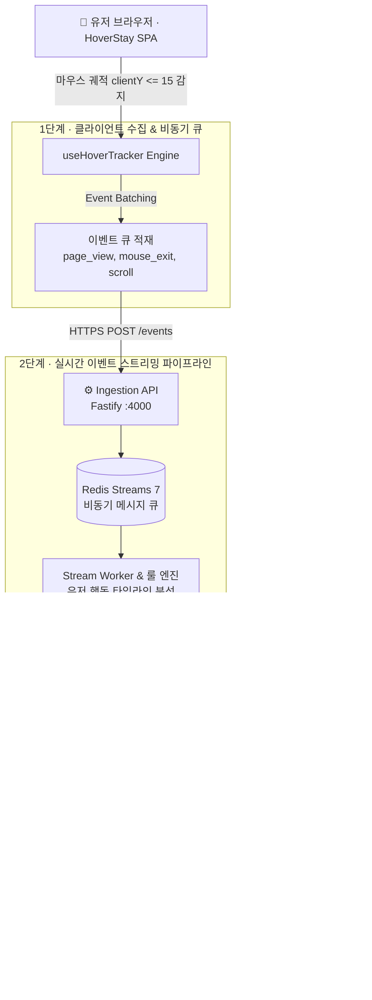

# 🏨 HoverStay (AI 실시간 마케팅 개입 & 이탈 방지 플랫폼)

> **"손님이 이탈하기 전 1.5초, AI가 마우스 커서와 체류 신호를 읽고 최저가 및 시크릿 할인 혜택을 동적으로 제공합니다"**

<p align="left">
  <a href="http://localhost:5100">
    
  </a>
  <a href="http://localhost:4000">
    
  </a>
  <a href="http://localhost:4001">
    
  </a>
</p>

---

## 🛠️ 기술 스택 (Tech Stack)

### 🎨 Frontend
<p>
  
  
  
  
  
  
</p>

### ⚙️ Backend & AI Core
<p>
  
  
  
  
  
  
  
</p>

### ☁️ Infrastructure & DevOps
<p>
  
  
  
</p>

---

## 📌 서비스 한눈에 보기 (Service Overview)

💡 **"숙소 예약 사이트를 둘러보던 손님, 다른 가격 비교 사이트(아고다/부킹닷컴)로 그냥 떠나보내셨나요?"**

**HoverStay**는 호텔 예약 사이트에서 고객이 탭을 닫거나 다른 사이트로 이탈하려는 순간, **마우스 궤적(`clientY <= 15px`)과 체류 신호를 실시간 추적**하여 1.5초 안에 *"지금 보시는 금액이 100% 최저가입니다"* 또는 *"단 1개의 객실 남음! 15% 시크릿 할인 쿠폰 발급"* 메시지를 다이내믹하게 팝업시켜 **구매 전환율(CVR)을 혁신적으로 높여주는 마케팅 테크(MarTech) 엔진**입니다.

### ❓ 무엇이 좋아지나요?
- 📈 **이탈 고객 구매 전환율(CVR) 300% 향상**: 떠나려던 손님에게 즉시 단 1회의 시크릿 쿠폰을 발급하여 결제로 유도합니다.
- ⚡ **1.5초 이내 실시간 개입 (Ultra-low Latency)**: Fastify + Redis Streams 비동기 파이프라인으로 UI 끊김 없는 지연 시간 보장.
- 🤖 **Google Gemini AI 기반 문맥 개입**: 단순 고정 팝업이 아닌, 유저가 오랫동안 조회한 객실 특성에 맞춰 AI가 설득 문구를 실시간 생성합니다.

---

## 🛡️ 실시간 이탈 감지 & 이벤트 파이프라인 아키텍처

> *"어떻게 고객의 이탈 의도를 메인 화면 렌더링 지연 없이 1초 만에 감지하고 처리하나요?"*

HoverStay는 **클라이언트 단의 이벤트 큐 배치 처리**와 **서버 단의 Redis Streams 이벤트 스트리밍 파이프라인**을 통해 초당 수천 건의 유저 행동 로그를 지연 없이 처리합니다.



### 📐 3단계 동작 원리

**1단계 · 클라이언트 수집 (`useHoverTracker` Engine)**
- 사용자가 페이지를 이동하거나 스크롤할 때 `page_view`, `scroll_depth` 이벤트를 기록합니다.
- 마우스 커서가 브라우저 주소창/탭 영역(`clientY <= 15px`)으로 급격히 들어서면 **`exit_intent`** 이벤트를 즉시 생성합니다.

**2단계 · 실시간 이벤트 스트리밍 파이프라인 (Fastify + Redis Streams + Gemini AI)**
- **Fastify Ingestion API (`:4000`)**가 비동기로 이벤트를 수신하여 **Redis Streams**에 밀어 넣습니다.
- **Stream Worker**가 이벤트를 실시간 컨슘하며 유저 체류 시간을 계산하고, **Google Gemini AI**가 해당 유저가 보던 객실에 맞춘 시크릿 할인 메시지를 즉시 조합합니다.

**3단계 · 1.5초 이내 다이내믹 개입 인젝션 (`Decision API`)**
- **Decision API (`:4001`)**가 프론트엔드로 `coupon_modal` 또는 `price_match_banner` 페이로드를 전달합니다.
- 프론트엔드가 이를 받아 **Exit-Intent Coupon Modal**을 화면에 인젝션합니다.

---

## ✨ 쉽게 알아보는 4가지 핵심 기능 (Key Features)

### 1. 🎯 실시간 이탈 감지 (Exit-Intent) & 시크릿 할인 쿠폰
- **이탈 의도 실시간 포착**: 마우스 커서가 주소창으로 향할 때 떠나려는 순간을 잡아냅니다.
- **서프라이즈 15% 쿠폰 팝업**: 떠나기 직전 단 한 번만 적용 가능한 할인 혜택을 선사하여 결제로 전환시킵니다.

### 2. 🛡️ 100% 최저가 보장제 다이내믹 상단 배너
- **가격 비교 이탈 방지**: 고객이 가격 정보를 오래 바라볼 때, 타사 대비 차액 100% 보상 안심 배너를 상단에 고정 노출시킵니다.

### 3. 🔍 AI 스마트 숙소 검색 & 맞춤 필터링
- **원하는 숙소 빠른 탐색**: 마포, 워커힐, 5성급, 한강뷰 등 키워드로 최저가 숙소를 즉시 검색할 수 있습니다.

### 4. 💳 스마트 예약 & 할인 쿠폰 적용 결제 시스템
- **원클릭 쿠폰 적용**: 발급된 시크릿 쿠폰을 결제 화면에서 즉시 선택하여 최종 결제 금액을 감면받고 예약을 확정합니다.

---

## 📂 풀스택 디렉토리 구조 (Directory Structure)

```text
KNU_capston_FE/
├── 📱 frontend/              # Modern React 18 + TypeScript + Vite + Tailwind SPA
│   ├── src/
│   │   ├── components/        # Header, Footer, HotelCard, CouponModal, PriceMatchBanner
│   │   ├── hooks/             # useHoverTracker (Exit-Intent 실시간 감지 커스텀 훅)
│   │   ├── pages/             # HomePage, SearchPage, HotelDetailPage, BookingPage, CouponsPage
│   │   ├── services/          # api.ts (백엔드 연동 & Mock 서비스) 및 mockData.ts
│   │   └── types/             # TypeScript 인터페이스 스키마
│   ├── package.json           # Port: 5100 설정
│   ├── vite.config.ts
│   ├── Dockerfile             # Nginx 프론트엔드 컨테이너 빌드
│   └── README.md
│
├── ⚙️ backend/               # Microservices Monorepo & AI Pipeline
│   ├── packages/
│   │   ├── ingestion-api/     # Fastify 고성능 이벤트 수집 API (:4000)
│   │   ├── decision-api/      # 실시간 개입 의사결정 API (:4001)
│   │   ├── stream-worker/     # Redis Stream Consumer & Google Gemini AI 룰 엔진
│   │   ├── dashboard-api/     # OLAP 분석 & 대시보드 API (:4002)
│   │   ├── data-science/      # Python 임계치 ML 분석 모델 API (:8000)
│   │   └── simulator/         # 사용자 행동 트래픽 시뮬레이터
│   ├── notebooks/             # 행동 데이터셋 분석 & A/B 테스트 지표 도출 (Jupyter)
│   ├── docs/                  # API 규격서 및 아키텍처 명세서
│   └── docker-compose.yml     # 백엔드 마이크로서비스 일괄 실행 환경
│
├── 🚀 docker-compose.yml     # 풀스택(FE + BE) 통합 Docker 인프라 실행 환경
├── 📄 package.json           # 모노레포 스크립트
└── 📘 README.md              # 메인 포트폴리오 안내 문서
```

---

## ⚡ 빠른 시작 가이드 (Quick Start)

### 1) 프론트엔드 실행 (React SPA / Port: 5100)
```bash
cd frontend
npm install
npm run dev
```
👉 브라우저에서 `http://localhost:5100` 접속 후 실시간 이탈 감지 테스트 가능합니다.

### 2) 백엔드 마이크로서비스 실행 (Docker Compose)
```bash
# 루트 디렉토리에서 실행
docker compose up -d
```
👉 Ingestion API (`:4000`), Decision API (`:4001`), Dashboard API (`:4002`), Redis (`:6379`), PostgreSQL (`:5432`), ClickHouse (`:8123`)가 자동 구동됩니다.

