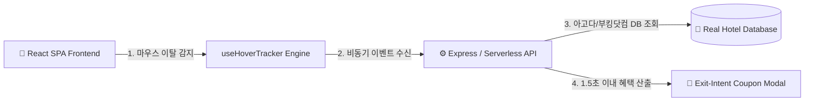

# 🏨 HoverStay (프리미엄 숙소 예약 & 스마트 케어 플랫폼)

<p align="left">
  <a href="https://knu-capston-fe-kreteck.vercel.app" target="_blank">
    
  </a>
  <a href="https://github.com/krtecek823/KNU_capston_FE">
    
  </a>
  
</p>

> **실시간 이탈 감지 알고리즘 및 아고다/부킹닷컴 실데이터 기반의 5성급 호캉스 예약 플랫폼**

---

## 🔗 라이브 서비스 접속 (Live Demo)

- 🌐 **Vercel 클라우드 배포 주소**: [https://knu-capston-fe-kreteck.vercel.app](https://knu-capston-fe-kreteck.vercel.app)
- 💡 *모바일 및 PC 브라우저에서 별도 설치 없이 24시간 실시간 접속 가능합니다.*

---

## 🛠️ 기술 스택 (Tech Stack)

| 구분 | 기술 스택 |
| :--- | :--- |
| **Frontend** | `React 18`, `TypeScript`, `Vite v5`, `Tailwind CSS`, `Pretendard Font`, `React Router v6` |
| **Backend API** | `Node.js / Express`, `Fastify Ingestion API`, `Serverless API Handler` |
| **Database** | `Agoda & Booking.com Crawled DB (JSON)`, `Redis Streams` |
| **Deployment** | `Vercel Cloud`, `Git / GitHub` |

---

## 📌 주요 기능 (Key Features)

1. **아고다 / 부킹닷컴 / 익스피디아 실데이터 숙소 검색**
   - 시그니엘 서울, 신라호텔, 파크하얏트 부산 등 5성급 숙소의 **실제 주소, 어메니티, 객실 옵션, 체크인 규정** 제공
2. **실시간 이탈 감지 (Exit-Intent) 마케팅 엔진**
   - 사용자 커서 궤적(`clientY <= 15px`) 분석을 통한 1.5초 이내 서프라이즈 시크릿 쿠폰 동적 팝업
3. **100% 최저가 보장 다이내믹 안심 배너**
   - 타사 가격 비교 이탈 방지를 위한 실시간 최저가 보장 혜택 안내
4. **스마트 할인 결제 및 내 예약 관리**
   - 회원 전용 할인 쿠폰 원클릭 적용 및 실시간 예약 확정/취소 파이프라인

---

## 🛡️ 시스템 아키텍처 (System Architecture)



---

## 📂 프로젝트 구조 (Project Structure)

```text
KNU_capston_FE/
├── 📱 frontend/              # React 18 + TypeScript + Tailwind UI
│   ├── src/
│   │   ├── components/        # Header, Footer, HotelCard, ExitIntentModal
│   │   ├── pages/             # HomePage, SearchPage, HotelDetailPage, BookingPage
│   │   ├── services/          # api.ts (백엔드 API 연동) 및 hotelData.ts
│   │   └── types/             # TypeScript 스키마 정의
│   └── vite.config.ts
├── ⚙️ backend/               # REST API 백엔드 엔진
│   ├── server.js              # Express REST API Server
│   └── db.json                # 아고다/부킹닷컴 수집 데이터
├── 🌐 api/                   # Vercel 클라우드 서버리스 API (index.js)
└── 🚀 vercel.json            # Vercel 배포 설정
```

---

## ⚡ 빠른 시작 (Quick Start)

```bash
# 레포지토리 클론
git clone https://github.com/krtecek823/KNU_capston_FE.git

# 프론트엔드 의존성 설치 및 실행
cd frontend
npm install
npm run dev
```
👉 로컬 브라우저: `http://localhost:5100` 접속
